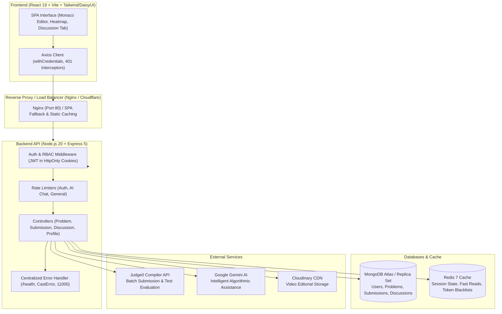

# CodeQuest 🚀
### Production-Grade Algorithmic Problem Solving & Code Execution Platform

CodeQuest is a modern, high-performance competitive programming and interview preparation platform inspired by LeetCode. Built on a resilient distributed stack, CodeQuest features real-time multi-language code compilation, automated test case evaluation with percentile rankings, AI-powered code assistance, dynamic activity heatmaps, community discussions, and database-backed administrative problem management.

---

## 🏗️ Architecture Overview



---

## 🌟 Key Features

### 1. Code Execution & Judge0 Engine
- **Multi-Language Support**: C++ (`gcc`), Java (`openjdk`), Python 3, and JavaScript (`node`).
- **Interactive Playground**: Integrated Monaco Editor with custom input/stdin support and instant output debugging.
- **Safety Limits**: 64 KB code size limit enforcement, polling timeout guards, and resource limits (time limit in ms, memory limit in MB).
- **Hidden & Visible Test Cases**: Strict validation against hidden edge cases with configurable error detail levels.

### 2. High-Performance Percentiles & O(1) Scalable Leaderboard
- **Percentile Engine ("Beats X% of users")**: Lightweight MongoDB count queries computing exact runtime and memory percentiles upon accepted submission without loading document sets into application heap.
- **O(1) Global Ranking**: Fast `$expr`-driven `countDocuments` query determining live global developer rank and percentile tiers, seamlessly handling users with 0 solved problems.
- **Dynamic 365-Day Activity Heatmap**: Submission activity calendar with persistent streak calculation (active days, current streak preservation, and max streak tracking).

### 3. Community Discussions & Solutions Tab
- **Community Forum**: Problem-specific discussion threads with code snippets, language tags, and markdown-ready formatting.
- **Engagement**: Upvoting system with toggle mechanics and threaded commenting.
- **Data Groundedness**: Strict user population ensuring sanitized author avatars and display names without credential exposure.

### 4. Role-Based Problem Creation & Editorial Videos
- **Admin Problem Creator**: Multi-step wizard to create and edit problems, define visible/hidden test cases, starter code templates, and reference solutions.
- **Solution Verification**: Automated check ensuring reference solutions pass all test cases before problem publishing.
- **Video Editorials**: Direct video solution streaming powered by Cloudinary.

### 5. Security & Reliability Hardening
- **Mass-Assignment Defense**: Strict payload whitelisting during registration preventing privilege escalation (`role: admin` override attempts).
- **Production Cookie Security**: Dynamic `SameSite` and `Secure` cookie headers tailored to cross-origin development and production environments.
- **Tiered Rate Limiting**: Dedicated protection for authentication endpoints (10 req / 15 min), Gemini AI chat (15 req / min), and general reads.
- **Centralized Error Handling**: Uniform JSON error responses for Mongoose `CastError`, `ValidationError`, duplicate key `E11000`, and JSON syntax errors with stack trace stripping in production.
- **Health Check Endpoint**: Public `GET /health` monitoring real-time MongoDB and Redis connectivity.

---

## 📋 Prerequisites

Ensure the following tools are installed on your machine:
- **Node.js**: `v20.x` or higher (Node 24 supported)
- **npm**: `v10.x` or higher
- **MongoDB**: Local MongoDB `v6.0+` instance or MongoDB Atlas connection URI
- **Redis**: Local Redis server (`redis-server`) or cloud Redis instance
- **Docker & Docker Compose** *(Optional, for containerized deployment)*

---

## ⚙️ Environment Variables

### Backend Configuration (`backend/.env`)

Copy `backend/.env.example` to `backend/.env` and configure your credentials:

```bash
cp backend/.env.example backend/.env
```

| Variable | Description | Default / Example |
| :--- | :--- | :--- |
| `PORT` | Backend server port | `3000` |
| `NODE_ENV` | Application environment (`development` / `production`) | `development` |
| `DB_CONNECT_STRING` | MongoDB connection URI | `mongodb://localhost:27017/Leetcode` |
| `REDIS_HOST` | Redis hostname | `127.0.0.1` |
| `REDIS_PORT` | Redis port | `6379` |
| `REDIS_PASSWORD` | Redis password (optional) | `""` |
| `JWT_KEY` | Secret key for signing JWT tokens | *Your strong random secret* |
| `JWT_EXPIRES_IN_SECONDS` | JWT cookie lifetime in seconds | `604800` (7 days) |
| `CORS_ORIGIN` | Allowed CORS origins (comma-separated) | `http://localhost:5173` |
| `CLIENT_URL` | Primary frontend URL | `http://localhost:5173` |
| `TRUST_PROXY` | Reverse proxy hop count | `1` |
| `COOKIE_SAMESITE` | Cookie SameSite mode (`lax` / `none` / `strict`) | `lax` |
| `JUDGE0_KEY` | RapidAPI / Judge0 authentication key | *Your Judge0 API key* |
| `GEMINI_KEY` | Google Gemini API key for AI assistant | *Your Gemini API key* |
| `CLOUDINARY_CLOUD_NAME`| Cloudinary Cloud Name for video uploads | *Your Cloudinary cloud name* |
| `CLOUDINARY_API_KEY` | Cloudinary API Key | *Your Cloudinary API key* |
| `CLOUDINARY_API_SECRET` | Cloudinary API Secret | *Your Cloudinary API secret* |

### Frontend Configuration (`frontend/.env`)

Copy `frontend/.env.example` to `frontend/.env`:

```bash
cp frontend/.env.example frontend/.env
```

| Variable | Description | Default |
| :--- | :--- | :--- |
| `VITE_API_URL` | Base URL for backend API requests | `http://localhost:3000` |

---

## 💻 Local Development Setup

### 1. Clone & Install Dependencies

```bash
# Clone the repository
git clone https://github.com/your-username/codequest.git
cd codequest

# Install backend dependencies
cd backend
npm install

# Install frontend dependencies
cd ../frontend
npm install
cd ..
```

### 2. Start Services Locally

**Terminal 1 — Backend:**
```bash
cd backend
npm run dev
# Server listening at port 3000
```

**Terminal 2 — Frontend:**
```bash
cd frontend
npm run dev
# Vite dev server running at http://localhost:5173
```

**Terminal 3 — Redis (if running locally):**
```bash
redis-server
```

Open [http://localhost:5173](http://localhost:5173) in your browser.

---

## 🧪 Automated Testing & Verification

The backend utilizes Node.js built-in zero-dependency test runner (`node:test` + `node:assert`).

### Running Backend Tests
```bash
cd backend
npm test
```

Test coverage includes:
- **`health.test.js`**: Validates `GET /health` returns HTTP 200 with live database connection statuses.
- **`auth_security.test.js`**: Validates registration mass-assignment rejection (`role: admin`) and guarantees public problem APIs never leak reference solutions or hidden test cases.
- **`percentile_math.test.js`**: Validates runtime and memory percentile calculation algorithms, tie handling, and boundary clamping.

### Running Frontend Linter & Production Build
```bash
cd frontend
npm run lint    # ESLint verification (0 errors required)
npm run build   # Production Vite bundle compilation
```

---

## 🐳 Docker Deployment

The platform includes a production-ready, multi-stage Docker Compose architecture containing backend, frontend SPA (with Nginx SPA routing), Redis 7, and optional MongoDB with persistent volumes.

### 1. Build and Run All Services
```bash
docker compose up --build -d
```

### 2. Service Endpoints
- **Frontend SPA**: [http://localhost](http://localhost) (Port 80)
- **Backend API**: [http://localhost:3000](http://localhost:3000)
- **Health Check**: [http://localhost:3000/health](http://localhost:3000/health)
- **MongoDB**: `localhost:27017`
- **Redis**: `localhost:6379`

### 3. Tear Down Containers
```bash
docker compose down
# To also delete persistent database volumes:
docker compose down -v
```

---

## 📡 API Reference Overview

| Method | Endpoint | Access | Description |
| :--- | :--- | :--- | :--- |
| `GET` | `/health` | Public | System status, uptime, and database/redis connectivity |
| `POST` | `/user/register` | Public (Rate-limited) | Account registration with mass-assignment protection |
| `POST` | `/user/login` | Public (Rate-limited) | User authentication with secure HttpOnly cookie issuance |
| `GET` | `/user/check` | Authenticated | Session validation & current user context |
| `GET` | `/user/getRank` | Authenticated | $O(1)$ live rank and percentile calculation |
| `GET` | `/user/activity-heatmap` | Authenticated | 365-day submission frequency & active streak metrics |
| `GET` | `/problem/list` | Public | Paginated problem list with tags and difficulty filtering |
| `GET` | `/problem/problemById/:id` | Public | Public problem specifications (sanitized) |
| `POST` | `/submission/run` | Authenticated | Execute code with custom stdin on Judge0 |
| `POST` | `/submission/submit` | Authenticated | Evaluate code across all testcases and compute percentiles |
| `GET` | `/discussion/problem/:problemId` | Public | Community discussion threads for a specific problem |
| `POST` | `/discussion/problem/:problemId` | Authenticated | Create a new discussion post |
| `POST` | `/discussion/:id/upvote` | Authenticated | Toggle upvote for a discussion post |
| `POST` | `/ai/chat` | Authenticated (Rate-limited) | Algorithmic code explanation & hints via Gemini AI |

---

## 📄 License
This project is open-source and available under the [ISC License](LICENSE).
