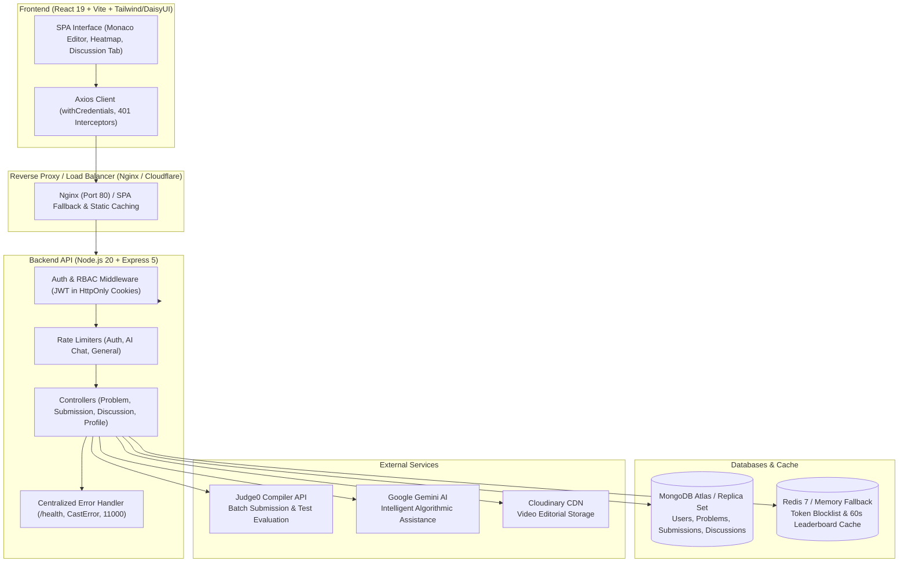

# CodeQuest 🚀
### Production-Grade Algorithmic Problem Solving & Code Execution Platform

CodeQuest is a modern, high-performance competitive programming and interview preparation platform inspired by LeetCode. Built on a resilient distributed stack, CodeQuest features real-time multi-language code compilation, automated test case evaluation with percentile rankings, AI-powered code assistance, dynamic activity heatmaps, community discussions, and database-backed administrative problem management.

---

## 🏗️ Architecture Overview



---

## 🌟 Key Features

### 1. Code Execution & Judge0 Engine
- **Multi-Language Support**: C++ (`gcc`), Java (`openjdk`), Python 3, and JavaScript (`node`).
- **Interactive Playground**: Integrated Monaco Editor with custom input/stdin support and instant output debugging.
- **Safety Limits**: 64 KB code size limit enforcement, polling timeout guards, and resource limits (time limit in ms, memory limit in MB).
- **Hidden & Visible Test Cases**: Strict validation against hidden edge cases with configurable error detail levels.

### 2. High-Performance Percentiles & O(1) Scalable Leaderboard
- **Percentile Engine ("Beats X% of users")**: Lightweight MongoDB count queries computing exact runtime and memory percentiles upon accepted submission without loading document sets into application heap.
- **O(1) Global Ranking**: Fast `$expr`-driven `countDocuments` query determining live global developer rank and percentile tiers, seamlessly handling users with 0 solved problems.
- **Dynamic 365-Day Activity Heatmap**: Submission activity calendar with persistent streak calculation (active days, current streak preservation, and max streak tracking).

### 3. Community Discussions & Solutions Tab
- **Community Forum**: Problem-specific discussion threads with code snippets, language tags, and markdown-ready formatting.
- **Engagement**: Upvoting system with toggle mechanics and threaded commenting.
- **Data Groundedness**: Strict user population ensuring sanitized author avatars and display names without credential exposure.

### 4. Role-Based Problem Creation & Editorial Videos
- **Admin Problem Creator**: Multi-step wizard to create and edit problems, define visible/hidden test cases, starter code templates, and reference solutions.
- **Solution Verification**: Automated check ensuring reference solutions pass all test cases before problem publishing.
- **Video Editorials**: Direct video solution streaming powered by Cloudinary.

### 5. Security & Reliability Hardening
- **Mass-Assignment Defense**: Strict payload whitelisting during registration preventing privilege escalation (`role: admin` override attempts).
- **Production Cookie Security**: Dynamic `SameSite` and `Secure` cookie headers tailored to cross-origin development and production environments.
- **Tiered Rate Limiting**: Dedicated protection for authentication endpoints (10 req / 15 min), Gemini AI chat (15 req / min), and general reads.
- **Centralized Error Handling**: Uniform JSON error responses for Mongoose `CastError`, `ValidationError`, duplicate key `E11000`, and JSON syntax errors with stack trace stripping in production.
- **Health Check Endpoint**: Public `GET /api/health` and `GET /health` monitoring real-time MongoDB and Redis connectivity.
- **JWT Token Blocklist**: Redis-backed blocklist on logout with in-memory fallback for free-tier demo deployments.

---

## 📋 Prerequisites

Ensure the following tools are installed on your machine:
- **Node.js**: `v20.x` or higher (Node 24 supported)
- **npm**: `v10.x` or higher
- **MongoDB**: Local MongoDB `v6.0+` instance or MongoDB Atlas connection URI
- **Redis**: Local Redis server (`redis-server`) or cloud Redis instance
- **Docker & Docker Compose** *(Optional, for containerized deployment)*

---

## ⚙️ Environment Variables

### Backend Configuration (`backend/.env`)

Copy `backend/.env.example` to `backend/.env` and configure your credentials:

```bash
cp backend/.env.example backend/.env
```

| Variable | Description | Default / Example |
| :--- | :--- | :--- |
| `PORT` | Backend server port | `3000` |
| `NODE_ENV` | Application environment (`development` / `production`) | `development` |
| `DB_CONNECT_STRING` | MongoDB Atlas / replica connection URI | `mongodb://localhost:27017/Leetcode` |
| `MONGO_TEST_URI` | Isolated MongoDB URI for automated test suites | `mongodb://localhost:27017/Leetcode_test` |
| `REDIS_HOST` | Redis hostname | `127.0.0.1` |
| `REDIS_PORT` | Redis port | `6379` |
| `REDIS_PASSWORD` | Redis password (optional) | `""` |
| `ALLOW_MEMORY_BLOCKLIST` | Use in-memory token blocklist when Redis is omitted | `false` |
| `JWT_KEY` | Secret key for signing JWT tokens | *Your strong random secret* |
| `JWT_EXPIRES_IN_SECONDS` | JWT cookie lifetime in seconds | `604800` (7 days) |
| `CORS_ORIGIN` | Allowed CORS origins (comma-separated) | `http://localhost:5173` |
| `CLIENT_URL` | Primary frontend URL | `http://localhost:5173` |
| `TRUST_PROXY` | Reverse proxy hop count (enable behind Render/Nginx) | `1` |
| `COOKIE_SAMESITE` | Cookie SameSite mode (`lax` / `none` / `strict`) | `lax` |
| `GENERAL_RATE_LIMIT_MAX` | Global rate limit request quota per window | `300` (prod) / `3000` (dev) |
| `GENERAL_RATE_LIMIT_WINDOW_MINUTES` | Global rate limit window size in minutes | `15` |
| `JUDGE0_BASE_URL` | Judge0 compiler endpoint (`RapidAPI` or self-hosted) | `https://judge0-ce.p.rapidapi.com` |
| `JUDGE0_KEY` | RapidAPI / Judge0 authentication key | *Your Judge0 API key* |
| `JUDGE0_POLL_MAX_ATTEMPTS` | Maximum polling attempts for batch submissions | `30` |
| `JUDGE0_POLL_INTERVAL_MS` | Delay between Judge0 polling attempts in ms | `1000` |
| `GEMINI_KEY` | Google Gemini API key for AI assistant | *Your Gemini API key* |
| `GEMINI_MODEL` | Primary Gemini model for algorithmic queries | `gemini-1.5-flash` |
| `GEMINI_FALLBACK_MODEL` | Fallback model if primary model experiences 429/404 | `gemini-1.5-pro` |
| `CLOUDINARY_CLOUD_NAME`| Cloudinary Cloud Name for video uploads | *Your Cloudinary cloud name* |
| `CLOUDINARY_API_KEY` | Cloudinary API Key | *Your Cloudinary API key* |
| `CLOUDINARY_API_SECRET` | Cloudinary API Secret | *Your Cloudinary API secret* |
| `SHOW_FAILED_HIDDEN_TEST_DETAILS` | Expose test details on failed hidden tests | `true` |
| `DEMO_PASSWORD` | Default password for idempotent demo seeder | `DemoPass@123` |

### Frontend Configuration (`frontend/.env`)

Copy `frontend/.env.example` to `frontend/.env`:

```bash
cp frontend/.env.example frontend/.env
```

| Variable | Description | Default |
| :--- | :--- | :--- |
| `VITE_API_URL` | Base URL for backend API requests | `http://localhost:3000` |

---

## 💻 Local Development Setup

### 1. Clone & Install Dependencies

```bash
# Clone the repository
git clone https://github.com/your-username/codequest.git
cd codequest

# Install backend dependencies
cd backend
npm install

# Install frontend dependencies
cd ../frontend
npm install
cd ..
```

### 2. Start Services Locally

**Terminal 1 — Backend:**
```bash
cd backend
npm run dev
# Server listening at port 3000
```

**Terminal 2 — Frontend:**
```bash
cd frontend
npm run dev
# Vite dev server running at http://localhost:5173
```

**Terminal 3 — Redis (if running locally):**
```bash
redis-server
```

Open [http://localhost:5173](http://localhost:5173) in your browser.

---

## 🧪 Automated Testing & Verification

The backend utilizes Node.js built-in zero-dependency test runner (`node:test` + `node:assert`).

### Running Backend Tests
```bash
cd backend
npm test
```

Test coverage includes:
- **`health.test.js`**: Validates `GET /health` returns HTTP 200 with live database connection statuses.
- **`auth_security.test.js`**: Validates registration mass-assignment rejection (`role: admin`) and guarantees public problem APIs never leak reference solutions or hidden test cases.
- **`percentile_math.test.js`**: Validates runtime and memory percentile calculation algorithms, tie handling, and boundary clamping.

### Running Frontend Linter & Production Build
```bash
cd frontend
npm run lint    # ESLint verification (0 errors required)
npm run build   # Production Vite bundle compilation
```

---

## 🐳 Docker Deployment

The platform includes a production-ready, multi-stage Docker Compose architecture containing backend, frontend SPA (with Nginx SPA routing), Redis 7, and optional MongoDB with persistent volumes.

### 1. Build and Run All Services
```bash
docker compose up --build -d
```

### 2. Service Endpoints
- **Frontend SPA**: [http://localhost](http://localhost) (Port 80)
- **Backend API**: [http://localhost:3000](http://localhost:3000)
- **Health Check**: [http://localhost:3000/health](http://localhost:3000/health)
- **MongoDB**: `localhost:27017`
- **Redis**: `localhost:6379`

### 3. Tear Down Containers
```bash
docker compose down
# To also delete persistent database volumes:
docker compose down -v
```

---

## 📡 API Reference Overview

| Method | Endpoint | Access | Description |
| :--- | :--- | :--- | :--- |
| `GET` | `/api/health` | Public | System status, uptime, and database/redis connectivity |
| `POST` | `/api/user/register` | Public (Rate-limited) | Account registration with mass-assignment protection |
| `POST` | `/api/user/login` | Public (Rate-limited) | User authentication with secure HttpOnly cookie issuance |
| `POST` | `/api/user/logout` | Authenticated | User logout with Redis token blocklist invalidation |
| `GET` | `/api/user/check` | Authenticated | Session validation & current user context |
| `GET` | `/api/user/getRank` | Authenticated | $O(1)$ live rank and percentile calculation |
| `GET` | `/api/user/activity-heatmap` | Authenticated | 365-day submission frequency & active streak metrics |
| `GET` | `/api/user/bookmarks` | Authenticated | Retrieve user bookmarked problem collection |
| `GET` | `/api/problem/all-lite` | Public | Lightweight problem array for fast client-side searching |
| `GET` | `/api/problem/list` | Public | Paginated problem list with tags and difficulty filtering |
| `GET` | `/api/problem/bySlug/:slug` | Public | Public problem specifications retrieved by slug |
| `GET` | `/api/problem/problemById/:id` | Public | Public problem specifications (sanitized without solutions) |
| `POST` | `/api/problem/:id/bookmark` | Authenticated | Toggle bookmark status for a problem |
| `GET` | `/api/problem/adminList` | Admin | Administrative problem list including hidden test cases |
| `POST` | `/api/submission/run/:id` | Authenticated | Execute code with custom stdin on Judge0 |
| `POST` | `/api/submission/submit/:id` | Authenticated | Evaluate code across all testcases and compute percentiles |
| `GET` | `/api/discussion/problem/:problemId` | Public | Community discussion threads for a specific problem |
| `POST` | `/api/discussion/problem/:problemId` | Authenticated | Create a new discussion post |
| `POST` | `/api/discussion/:id/upvote` | Authenticated | Toggle upvote for a discussion post |
| `POST` | `/api/ai/chat` | Authenticated (Rate-limited) | Algorithmic code explanation & hints via Gemini AI |
| `GET` | `/api/leaderboard` | Public | Real-time top 50 leaderboard with 60s cache and difficulty breakdown |

---

## 🎯 Demo Guide & 5-Minute Walkthrough

### 1. Seed Demo Data (Idempotent)
To populate the database with realistic developer accounts, 30-day submission heatmaps, bookmarks, and threaded discussions:

```bash
# Optional: customize demo password via DEMO_PASSWORD env variable
export DEMO_PASSWORD="DemoPass@123"

# Run idempotent seeder
node backend/scripts/seed_demo.js
```

### 2. Demo User Credentials
> **Default Password**: `DemoPass@123` (or the value set in `DEMO_PASSWORD`)

| Account Type | Email | Role | Seeded Stats |
| :--- | :--- | :--- | :--- |
| **Admin** | `admin@codequest.dev` | `admin` | Full problem authoring & management access |
| **Coder #1** | `alex.chen@demo.com` | `user` | Rank #1, 14 Solved, 7-Day Active Streak |
| **Coder #2** | `priya.sharma@demo.com` | `user` | Rank #2, 10 Solved, 5-Day Active Streak |
| **Coder #3** | `marcus.vance@demo.com` | `user` | Rank #3, 7 Solved, 3-Day Active Streak |
| **Coder #4** | `elena.rostova@demo.com` | `user` | Rank #4, 4 Solved, 2-Day Active Streak |
| **Coder #5** | `david.kim@demo.com` | `user` | Rank #5, 2 Solved, 1-Day Active Streak |

---

### 3. Step-by-Step 5-Minute Evaluation Script

1. **Sign In**:
   - Navigate to `/login` and sign in as `alex.chen@demo.com` (password: `DemoPass@123`).
   - Notice instant redirection to the coding arena with your profile avatar and streak flame indicator.

2. **Problem Directory & Tag Filtering**:
   - Browse `/problems`.
   - Filter problems by topic pills (e.g. `Arrays`, `Strings`, `Mathematics`, `Dynamic Programming`).
   - Click the **Bookmarked** filter chip to view problems saved to your personal library.
   - Click the **Star** icon next to any problem title to toggle bookmarks on/off with instant optimistic UI feedback.

3. **Compiler Arena & Custom Input**:
   - Open any challenge (e.g. `/problems/two-sum` or `/problems/addition-of-two-numbers`).
   - Choose your preferred language (C++, Java, Python3, JavaScript).
   - In the bottom drawer, test **Custom Input** and click **Run Code** to inspect standard output.
   - Click **Submit** to run your solution against hidden test cases. View real-time runtime and memory percentiles ("Beats X% of users").

4. **AI Algorithmic Assistant (Gemini)**:
   - In the problem left pane, click the **ChatAI** tab.
   - Ask for a complexity analysis or edge case hint (e.g., *"What is the time complexity of this solution?"*).
   - Notice rate-limited, formatted responses designed to guide without spoiling answers.

5. **Community Discussions & Solutions**:
   - Switch to the **Discussions** tab.
   - Inspect formatted community solutions containing clean syntax highlighting.
   - Click the upvote button to endorse helpful solutions and observe instant count increments.
   - Read peer comments explaining space/time trade-offs.

6. **Live Leaderboard**:
   - Click **Leaderboard** in the top navigation bar (`/leaderboard`).
   - Review the top 50 participants with **#1 Gold**, **#2 Silver**, and **#3 Bronze** ranking badges.
   - Notice the Easy/Medium/Hard difficulty breakdown badges per developer.
   - When viewing as a participant outside the top 50, observe the sticky bottom rank banner: `Your Rank: #X | Solved: Y`.

7. **Developer Profile & Activity Heatmap**:
   - Click your avatar in the top right and select **My Profile** (`/profile`).
   - View your 365-day submission activity heatmap, persistent streak calculation, and solve breakdown.

8. **Admin Management Panel**:
   - Sign out and log in as `admin@codequest.dev`.
   - Click **Admin** in the navigation bar.
   - Navigate to `/admin/create` to publish a new challenge with hidden test cases and starter templates, or `/admin/update` to edit existing problems.

---

## 📄 License
This project is open-source and available under the [ISC License](LICENSE).
